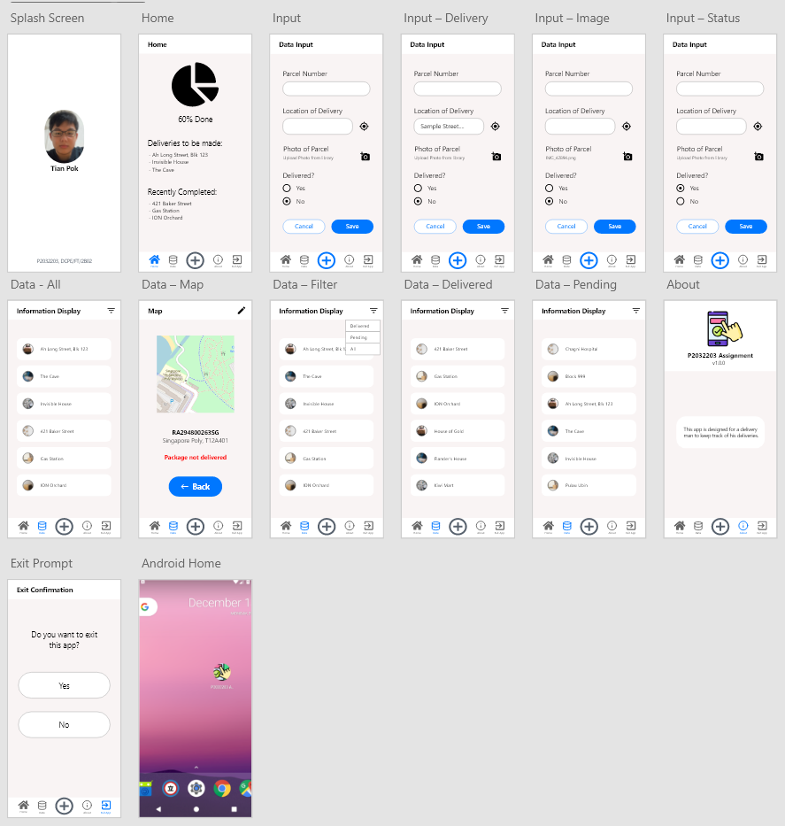
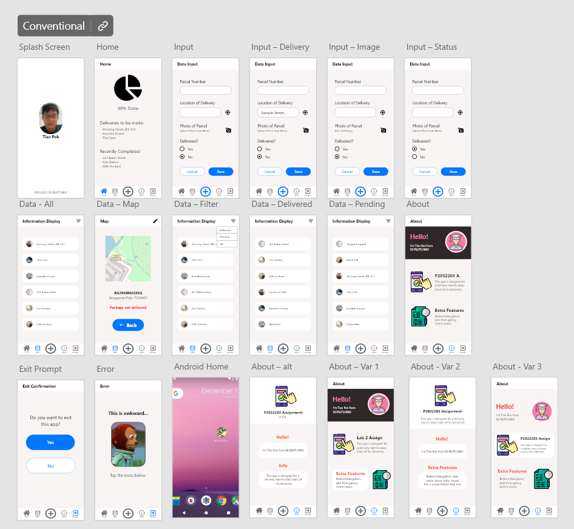

# P2032203-Assignment

### Info
- MAD Lab Assignment done during Y2S2 Holidays
- Click this [link](https://xd.adobe.com/view/9d563f22-94b8-4581-83c2-aa175e78e35c-c805/) to try it out
### TODO
- [ ] Enable user to edit data
- [ ] Filter the data according to delivered/not delivered
- [ ] Add pie chart api

## Concept
In this assignment, you are to develop a data entry application. This is an open concept assignment where you have to decide on the prupose of this application athat must meet the basic
design requirements.

### Basic Requirements
1. Youre app will start up with a splash screen that shows your phot image, name, admission number and class. The duration is 3s.
2. After the splash screen display, it will start a "Home" activity.
3. The "Home" activity should include options:
  #### Options
  1. To launch an "About" activity.
  2. To launch a "Data Input" activity
  3. To launch an "Information Display" activity.
  4. To exit the application.

<!---- ## Prototype

## Semi-final Prototype
 ---->

## Finalised Prototype

<!-- Click this [link](https://xd.adobe.com/view/9d563f22-94b8-4581-83c2-aa175e78e35c-c805/) to try it out -->

   
  

<!---
## Misc
### SQL Delivery Percentage
| status (0)            | percentage (1)  |
| --------------------- | --------------- |
| package delivered     | xxx             |
| package not delivered | xxx             |
--->
