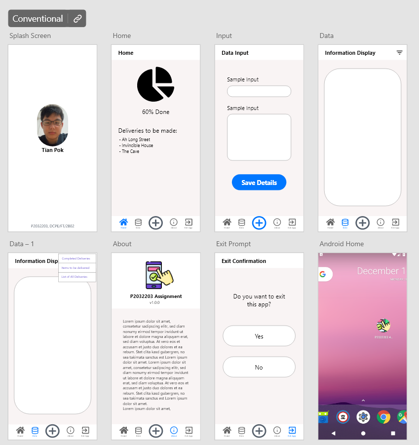

# P2032203-Assignment 
MAD Lab Assignment done during Y2S2 Holidays

## Concept
In this assignment, you are to develop a data entry application. This is an open concept assignment where you have to decide on the prupose of this application athat must meet the basic
design requirements.

## Basic Requirements
1. Youre app will start up with a splash screen that shows your phot image, name, admission number and class. The duration is 3s.
2. After the splash screen display, it will start a "Home" activity.
3. The "Home" activity should include options:
  ### Options
  1. To launch an "About" activity.
  2. To launch a "Data Input" activity
  3. To launch an "Information Display" activity.
  4. To exit the application.

## "Data Input" Activity
## "Information Display" Activity

## Prototype

Click this [link](https://xd.adobe.com/view/2ab55f7a-1fb0-4f49-bfcc-20b372b67357-7fe6/) to try it out
